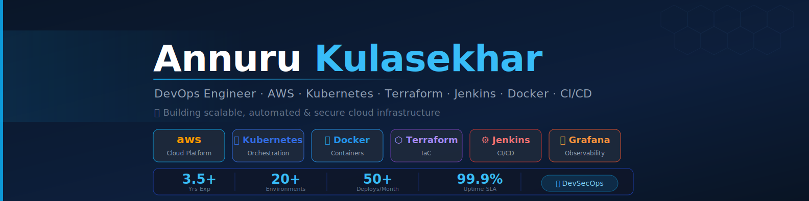

<!-- ========================================= -->
<!--                BANNER                     -->
<!-- ========================================= -->

  

<h1 align="center">👋 Hi, I'm Kulasekhar Annuru</h1>

<h3 align="center">
DevOps Engineer | AWS | Kubernetes | Terraform | Jenkins | Docker | CI/CD | DevSecOps
</h3>

Experienced DevOps Engineer with 3.5+ years of expertise in AWS cloud infrastructure, Kubernetes, CI/CD automation, and production-grade deployment environments.

---

# 🚀 About Me

💻 DevOps Engineer with hands-on experience in designing, automating, and managing scalable cloud-native infrastructure on AWS.

☸️ Specialized in Kubernetes (Amazon EKS), CI/CD automation, Infrastructure as Code (Terraform), Docker containerization, and DevSecOps practices.

⚡ Strong experience in:
- CI/CD Pipeline Automation
- Kubernetes & Helm
- Docker & Containerization
- Terraform & Infrastructure as Code
- AWS Cloud Engineering
- Jenkins Pipeline Automation
- Linux Administration
- Monitoring & Observability
- DevSecOps & Security Automation

📍 Bangalore, India

---

# 🏆 Professional Highlights

✅ Reduced deployment time by **40%** using Jenkins CI/CD automation

✅ Automated infrastructure provisioning and configuration management

✅ Managed **20+ microservices** on Amazon EKS

✅ Maintained **99.9% uptime** across production environments

✅ Improved incident response time by **35%** using Prometheus & Grafana

✅ Implemented rolling deployments and automated rollback strategies

✅ Integrated SonarQube, SAST, DAST, and image scanning into CI/CD pipelines

✅ Built reusable Terraform modules for AWS multi-environment deployments

---

# 🛠️ Tech Stack

---

# 🔧 What I Do

🚀 Build scalable and secure AWS cloud infrastructure

⚙️ Develop production-grade CI/CD pipelines using Jenkins & Git

☸️ Deploy and manage Kubernetes workloads on Amazon EKS

🐳 Containerize applications using Docker

🏗️ Automate infrastructure provisioning using Terraform & Ansible

📊 Implement monitoring and alerting using Prometheus & Grafana

🔐 Enable DevSecOps practices for secure application delivery

🛠️ Troubleshoot production issues and optimize deployment reliability

---

# 📂 Featured Projects

🚀 Kubernetes & Cloud Platform Engineering
• Managed and deployed microservices on Amazon EKS
• Implemented Helm-based Kubernetes deployments
• Configured rolling updates and rollback strategies
• Integrated Prometheus & Grafana monitoring stack
• Automated infrastructure provisioning using Terraform

⚙️ CI/CD & DevSecOps Automation
• Built reusable Jenkins CI/CD pipelines
• Integrated SonarQube, SAST, DAST, and image scanning
• Automated deployments using Ansible and Shell scripting
• Implemented Infrastructure as Code for multi-environment deployments
• Improved deployment reliability and operational efficiency
---

# 🔥 GitHub Streak

---

# 🐍 Contribution Snake

---

# 🎯 Goals for 2026

🚀 Advanced Kubernetes & Platform Engineering

🚀 GitOps with ArgoCD

🚀 Production-grade DevSecOps

🚀 AI + DevOps (AIOps)

🚀 Open Source Contributions

🚀 Multi-Cloud Infrastructure Automation

---

# 🔗 Connect With Me

---

⭐ <b>"Automating infrastructure, improving reliability, and delivering scalable cloud-native systems."</b>

